# Project Flowcharts - Sisoy Resort Booking System

Visual diagrams illustrating the application flow and architecture.

## 📊 Table of Contents

1. [System Architecture](#system-architecture)
2. [User Authentication Flow](#user-authentication-flow)
3. [Booking Creation Flow](#booking-creation-flow)
4. [Data Sync Flow](#data-sync-flow)
5. [Database Schema](#database-schema)
6. [API Request Flow](#api-request-flow)

---

## System Architecture

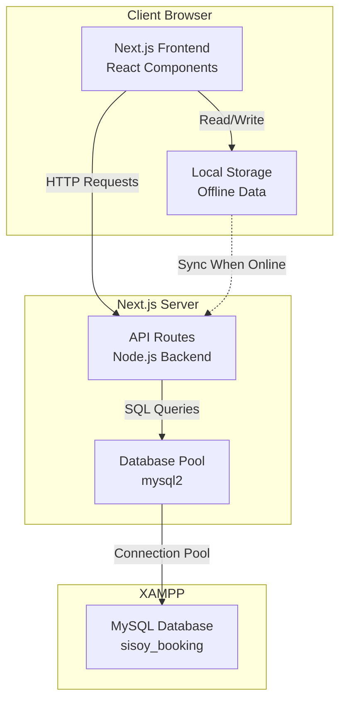

**Components:**
- **Frontend:** Next.js 16 pages with React 19
- **Backend:** Next.js API routes (serverless functions)
- **Database:** MySQL via XAMPP with connection pooling
- **Storage:** LocalStorage for offline capability

---

## User Authentication Flow

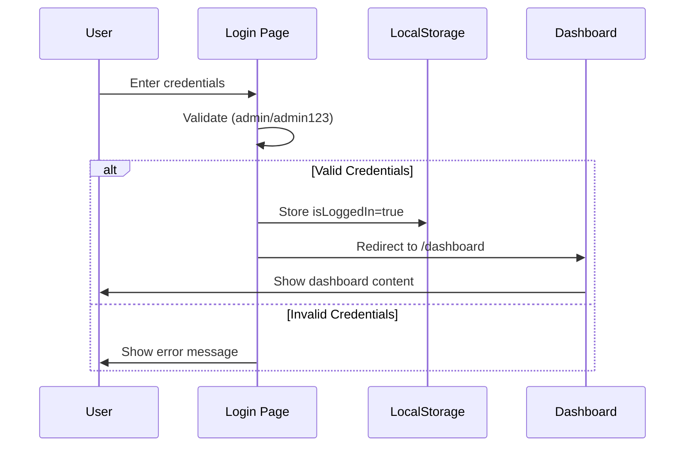

**Authentication Steps:**
1. User enters username and password
2. Client-side validation checks credentials
3. Success: Store auth token in localStorage
4. Redirect to dashboard
5. All dashboard routes check localStorage for auth

---

## Booking Creation Flow

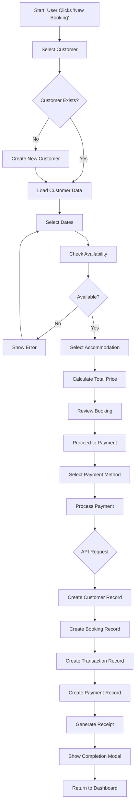

**Key Points:**
- Linear flow with validation at each step
- Automatic availability checking
- Atomic transaction (all records created together)
- Receipt generation upon success

---

## Data Sync Flow

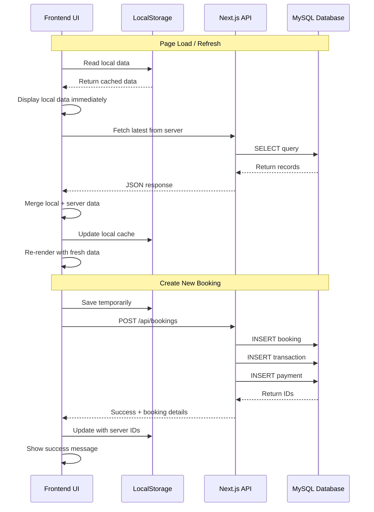

**Sync Strategy:**
- **Optimistic UI:** Show local data immediately
- **Background sync:** Fetch server data asynchronously
- **Merge:** Combine local and server data (deduplication)
- **Write-through:** All mutations go to server first

---

## Database Schema

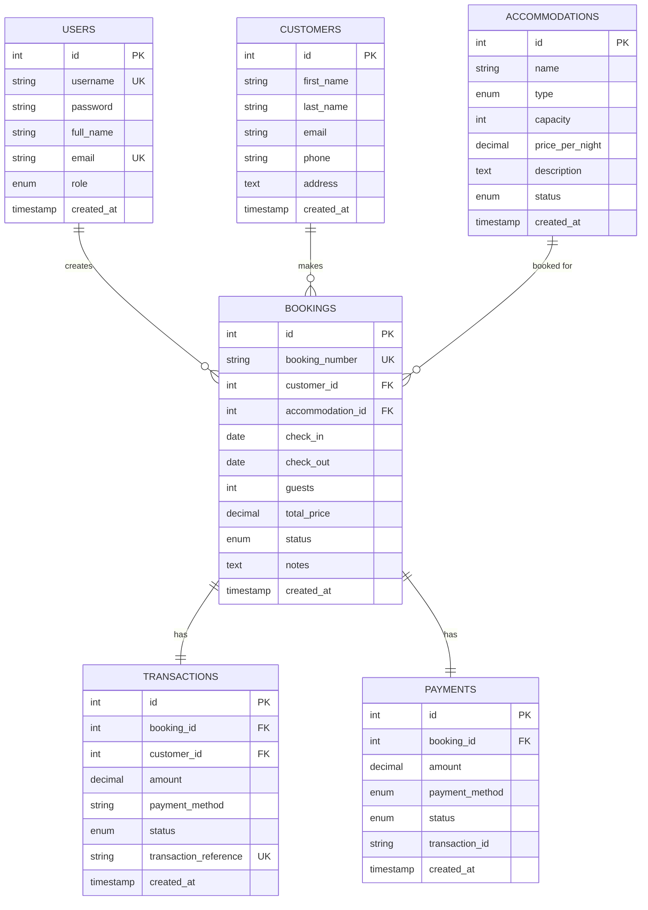

**Relationships:**
- One customer can have many bookings
- One accommodation can have many bookings
- Each booking has one transaction
- Each booking has one payment record
- Users create bookings (audit trail)

---

## API Request Flow

### GET Request (Fetch Bookings)

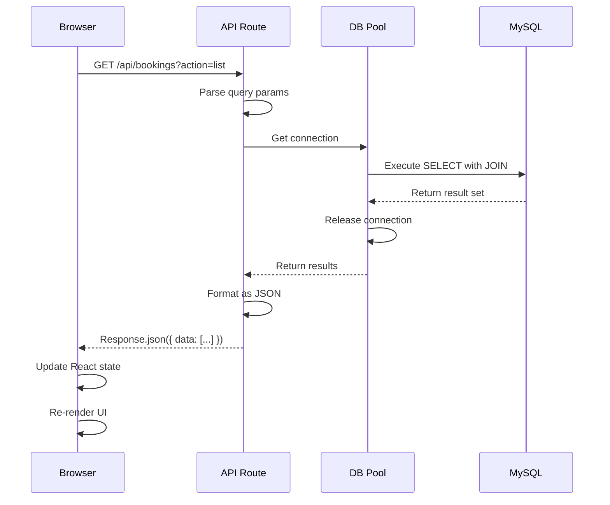

### POST Request (Create Booking)

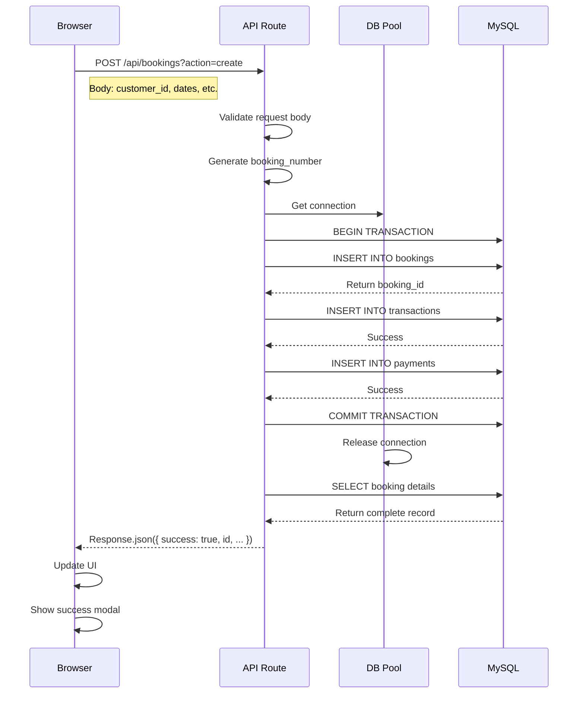

---

## Page Navigation Flow

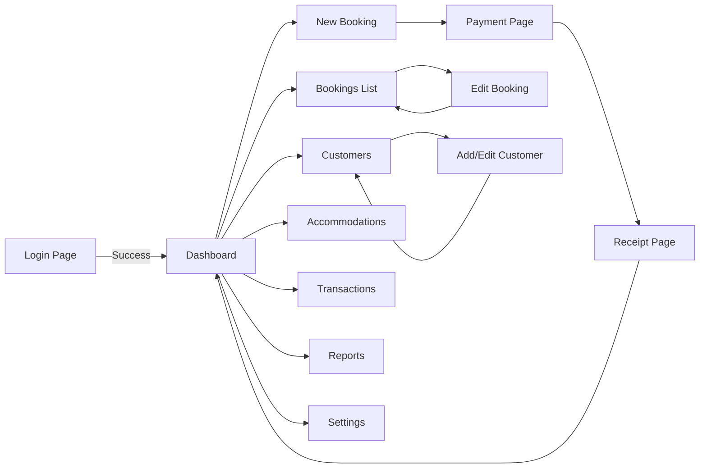

**Navigation:**
- All routes under `/dashboard` require authentication
- Booking flow: New → Payment → Receipt → Dashboard
- CRUD operations return to list view

---

## Component Hierarchy

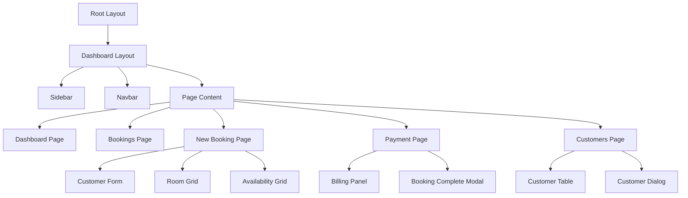

**Component Structure:**
- **Layout components:** Shared UI (sidebar, navbar)
- **Page components:** Route-specific views
- **Feature components:** Booking flow, customer management
- **UI components:** Reusable buttons, inputs, modals

---

## Booking State Machine

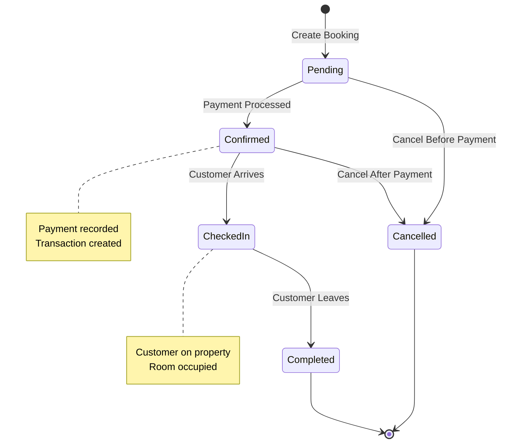

**Booking States:**
1. **Pending:** Initial state, awaiting payment
2. **Confirmed:** Payment complete, reservation active
3. **Checked-in:** Customer arrived, using accommodation
4. **Completed:** Stay finished, ready for checkout
5. **Cancelled:** Booking cancelled (refund may apply)

---

## Error Handling Flow

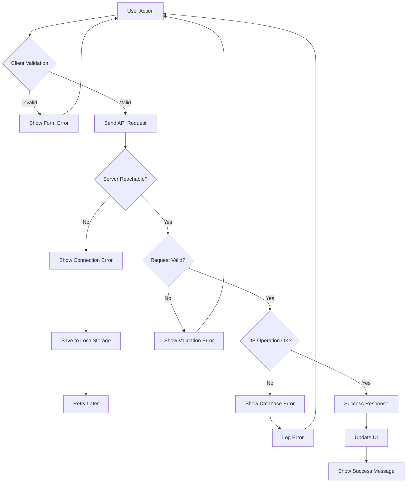

**Error Handling:**
- **Client-side:** Form validation before submission
- **Network errors:** Save locally, retry when online
- **Server errors:** Display user-friendly messages
- **Database errors:** Log for debugging, show generic error

---

## Data Flow Summary

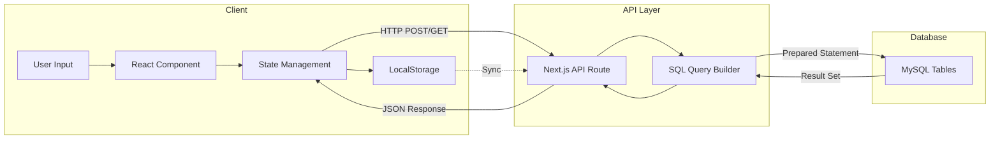

**Flow:**
1. User interacts with React components
2. State updates trigger API calls
3. API routes execute database queries
4. Results flow back to frontend
5. UI updates with new data
6. LocalStorage syncs for offline use

---

## Deployment Architecture

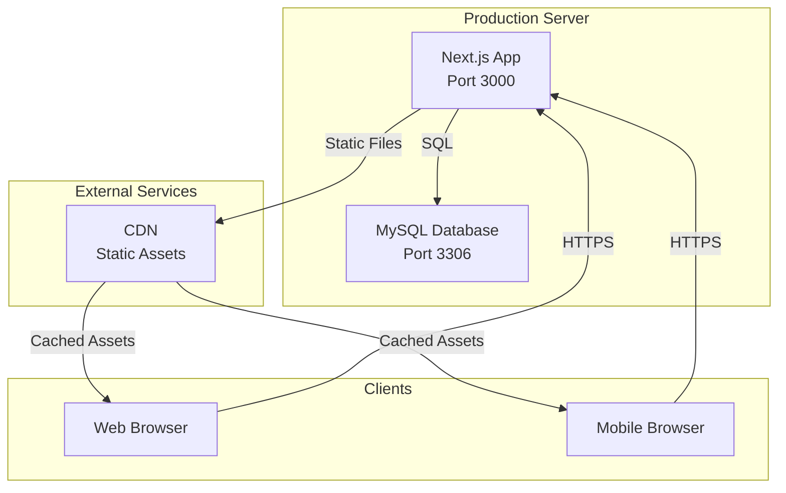

**Production Setup:**
- Next.js server handles all API + SSR
- MySQL database on same or separate server
- Static assets served via CDN
- HTTPS for secure communication

---

## Quick Reference: Key Files

| Component | File Path | Purpose |
|-----------|-----------|---------|
| Database Connection | `lib/db.js` | MySQL pool & query function |
| API Helper | `lib/api.ts` | Determine API base URL |
| Bookings API | `app/api/bookings/route.js` | CRUD for bookings |
| Customers API | `app/api/customers/route.js` | CRUD for customers |
| Dashboard Page | `app/(dashboard)/dashboard/page.tsx` | Main overview screen |
| New Booking | `app/(dashboard)/booking/new/page.tsx` | Create reservations |
| Payment Flow | `app/(dashboard)/booking/payment/page.tsx` | Process payments |
| Login | `app/login/page.tsx` | Authentication |

---

## Technology Stack Diagram

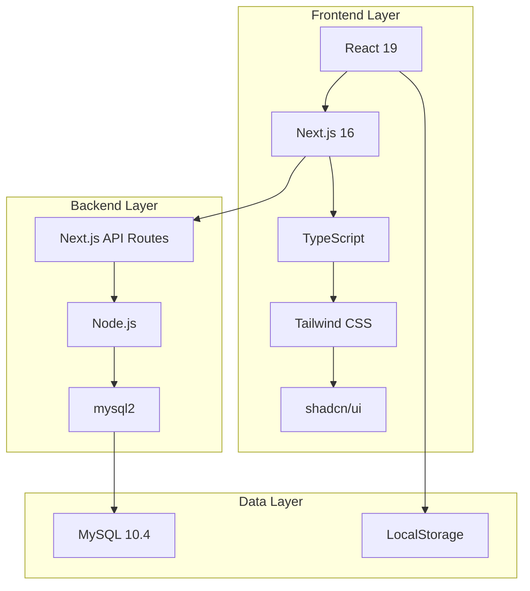

---

## Summary

This booking system uses a modern, scalable architecture:

- **Full-stack JavaScript:** Next.js handles both frontend and backend
- **Type-safe:** TypeScript for better developer experience
- **Responsive:** Tailwind CSS + shadcn/ui components
- **Real-time:** Direct MySQL queries via API routes
- **Offline-capable:** LocalStorage fallback
- **Secure:** Parameterized queries prevent SQL injection

For detailed code explanations, see [CODE_DOCUMENTATION.md](CODE_DOCUMENTATION.md)
